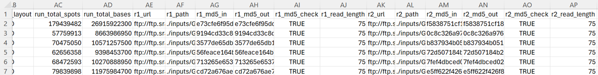

# Find The Best Sequencing Studies 

**Goal:** Since all companies use public data, this workflow finds gold-standard studies quickly based on your search query. Ultimately, we want to work with the most reliable, sufficiently powered sequencing studies.

## Visual Summary

## Overview
Starting with a search query, this pipeline will do the following:

**Script 1 [Py]:**
Collect relevant sequencing studies from data repos. The repos are:
1. Gene Expression Omnibus ([GEO](https://www.ncbi.nlm.nih.gov/gds/advanced/))
	- Example GEO search query: `'Retinitis pigmentosa[All Fields] AND Homo sapiens[Organism] AND 10:1000[Number of Samples] AND "expression profiling by high throughput sequencing"[DataSet Type]'`
2. Sequence Read Archive ([SRA](https://www.ncbi.nlm.nih.gov/sra/advanced))
3. European Nucleotide Archive ([ENA](https://www.ebi.ac.uk/ena/browser/text-search))
4. Expression Atlas ([EA](https://www.ebi.ac.uk/gxa/home))

**Script 2 [Py]:**
Select studies for downstream analysis based on your own criteria. For each selected study:
1. Download samples, such as fastq files
2. Create sample sheet containing metadata, such as sample IDs, sample names, study/GEO accession, organism, disease state, fastq file paths, library layout (single or paired end), and more. For a complete list of metadata columns, see FAQ #3.
3. **Downstream analysis example:** The samples and sample sheet can be used for [RNA-Seq alignment](https://github.com/matthewonorato/Align_RNAseq).
4. **Example criteria for study selection:** sufficient statistical power (n>4 per group), contains control/normal/healthy samples, sufficient sequencing depth (check spots!), contains the correct species, tissue/cell type and data type

## Example File: Search Results (All Studies)

## Example File: Sample Sheet (Single Study)

## FAQ
1. Why does this workflow search through four different data repos?
	- **The best study for your intended purpose may be anywhere, which is why it's important to look in more than one place.** Many gold-standard studies can be found in GEO, however, the study most relevant to you may be somewhere else.
2. What can I do with the data and metadata from my selected studies?
	- If you've acquired RNA-Seq data, you can align it to a reference genome using the [Align_RNAseq](https://github.com/matthewonorato/Align_RNAseq) pipeline. Otherwise, you can use an appropriate pipeline for your data type, such as the Nextflow-based pipelines found in [nf-core](https://github.com/nf-core).
3. What metadata is actually captured in the sample sheet?
	- This depends on which columns you keep while working through script 2. At a minimum though, the following metadata columns are retained *for each sample*:
		- **Sample info:** `sample ID, sample name, series ID, geo accession, study accession, run accession`
		- **Biological info:** `organism, taxon ID, genome build, release version, disease state, biological replicate, tissue type, cell type, group (ex. disease state + tissue/cell type + dose [if applicable] + time [if applicable]`)
		- **Technical info:** `data source, molecule type (ex. total RNA), instrument model, platform ID, library selection, library source, library strategy, library layout, run total spots, run total bases`
		- **Read info:** `r1 url, r1 path, r1 md5 in, r1 md5 out, r1 md5 check, r1 read length, r2 url, r2 path, r2 md5 in, r2 md5 out, r2 md5 check, r2 read length`
